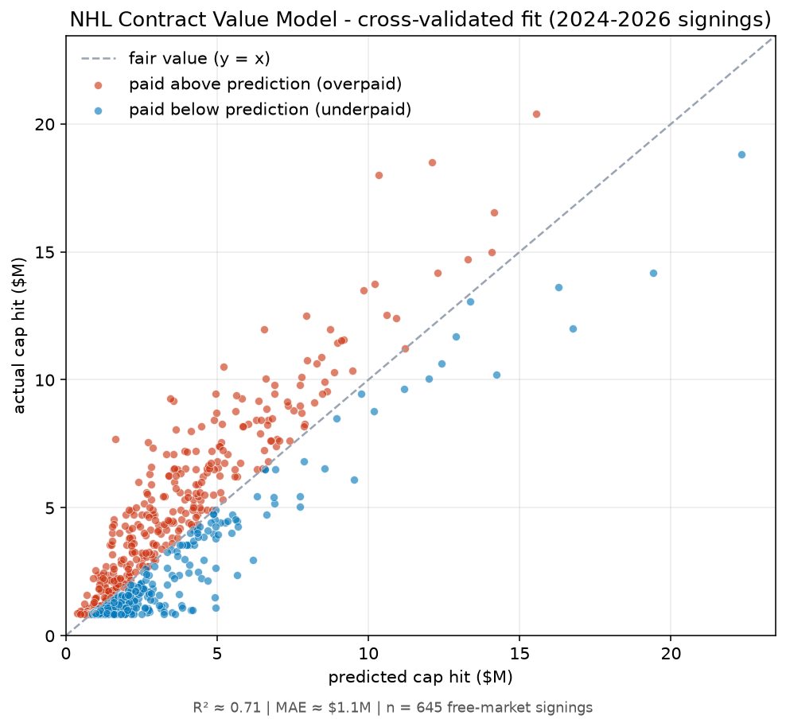
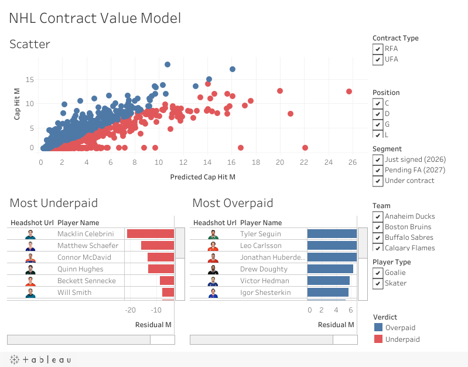

# NHL Contract Value Model

Estimates a fair cap hit for every current NHL player from his 2025-26 performance, then
ranks contracts by **residual (actual − predicted)** to flag the most over- and under-paid
deals. Interactive Streamlit dashboard with NHL headshots and team logos.

A value/inefficiency tool, not a crystal ball - it can't see prospect upside, intangibles,
or negotiation leverage, which is exactly what its biggest residuals are made of.

**Start here:** [`notebooks/contract_value_model.ipynb`](notebooks/contract_value_model.ipynb)
is a rendered, end-to-end walkthrough - the data, why the target is `log(cap %)`, the fitted
equation with coefficients, cross-validated error, and the over/under-paid rankings - readable
on GitHub without cloning or running anything.



*Each dot is a signing: above the dashed line = paid more than the model predicts (overpaid),
below = underpaid. Cross-validated so no player was in the model that priced him.*

## Model

- **Skaters:** linear regression on `log(cap hit ÷ salary cap)` from 7 features - scoring
  rate, individual expected goals/60, ice time, games played, age, UFA/RFA status, and
  position. Fit on the 2024-2026 free-market signings (~645 rows), then applied to every
  current skater. **CV R² ≈ 0.71, MAE ≈ $1.1M.**
- **Goalies:** a smaller secondary model - games started, age, status (R² ≈ 0.44).

## Key findings

- **Residuals are interpretable.** "Overpaid" is mostly young stars whose production hasn't
  caught up to upside-priced deals; "underpaid" is genuine below-market veterans (e.g. Quinn
  Hughes) plus CBA-capped ELC rookies.
- **A salary model can only value what the market rewards.** Adding defensive metrics
  (skaters) or GSAx (goalies) barely moved anything - goalie pay tracks *workload* (starts),
  not save quality.
- **Cap-era normalization matters.** Modeling pay as a percent of the cap (not raw dollars)
  keeps rising-cap seasons comparable.

## Data & terms

Performance from the **NHL Stats API** and **Hockey-Reference**; individual xG from
**MoneyPuck** (manual download - its ToS blocks scripts); goalie GSAx from **Natural Stat
Trick**; current contracts and signings scraped from **CapWages** (robots.txt permits
crawling; raw data kept out of the repo). PuckPedia/Spotrac prohibit scraping and aren't
used.

## Run

```bash
pip install -r requirements.txt
streamlit run app.py                 # dashboard (reads pre-built ranking CSVs)
```

Rebuild the data:

```bash
python -m src.fetch_capwages         # scrape current contracts (~2 min)
python -m src.build_dataset          # skaters
python -m src.build_goalie_2026      # goalies
python -m src.generate_rankings      # writes the ranking CSVs the app reads
```

## Dashboards

- **Tableau Public** (interactive, hosted) - [live dashboard](https://public.tableau.com/app/profile/darren.huang6974/viz/NHLContractValueModel/NHLContractValueModel)
- **Streamlit** (local, Python) - `streamlit run app.py`

[](https://public.tableau.com/app/profile/darren.huang6974/viz/NHLContractValueModel/NHLContractValueModel)

## Limitations

Residuals are descriptive, not causal. ELC rookies look underpaid by construction (their pay
is CBA-capped). The model reflects what the market pays, so it can't value upside, defense, or
intangibles the market itself underprices. The goalie model is small (55 contracts) and
secondary.
